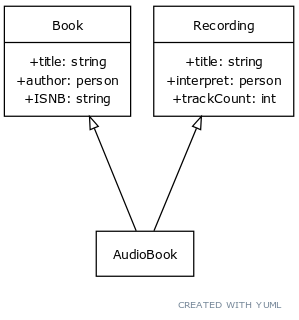
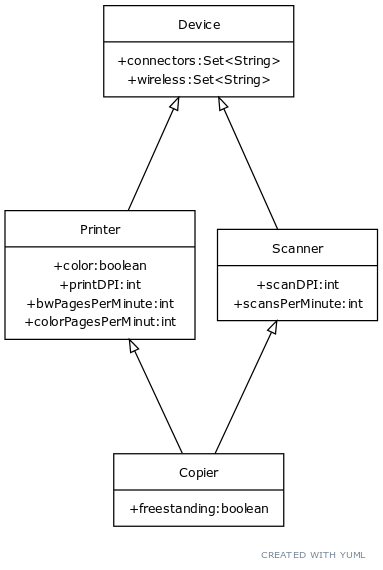

# Simple demo to demonstrate multiple inheritance in JOPA
This is a simple Spring application, that enables CRUD operations over few entities.

There are two separate hierarchies, demonstrating two different inheritance strategies.

In first example a simpler hierarchy is used, where class AudioBook is a subclass of both Book and Recording.
Both parents independently declare a single property, and these two properties are equal in name and RDF properties.

In the second example a typical diamond hierarchy is used. This means a child class, Copier,
inherits from two parents, Scanner and Printer, which share a common ancestor - class Device.

Purpose of this repository is to demonstrate JOPAs ability to correctly handle operations over these hierarchies.

## Requirements

Application is written in Java and built using Maven. To run, the following is required:

- Java 8 or later
- Apache Maven 3.x

## Running the application
To run the application, use `mvn spring-boot:run` to start.
The REST API can be found at 'localhost:8080'

## Friendly way to test the application
Use provided [Postman](https://www.postman.com/) collection  to test the application in user-friendly way.
This collection can be found in `postman-collection` folder.

